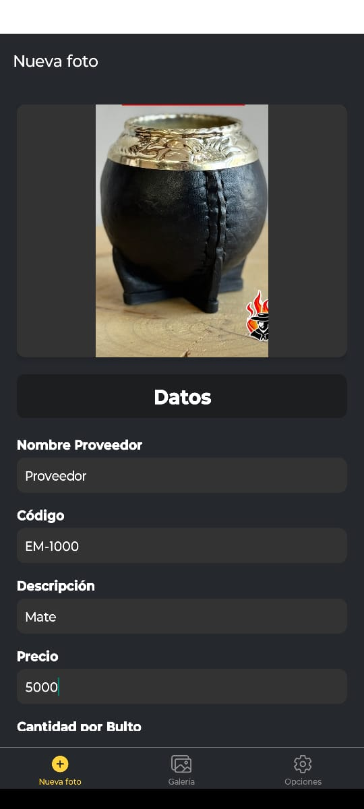
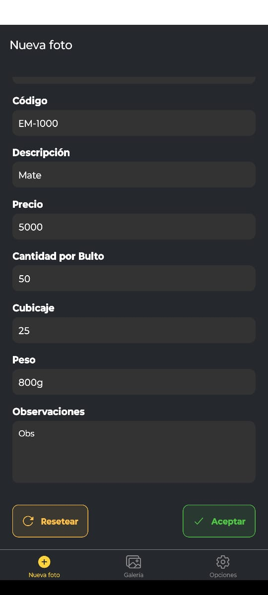
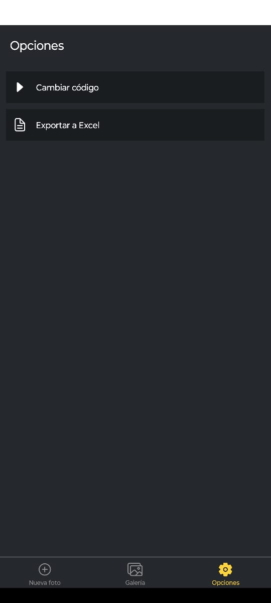
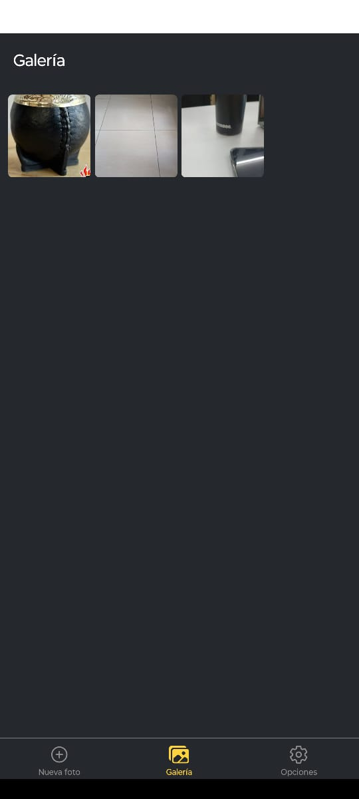
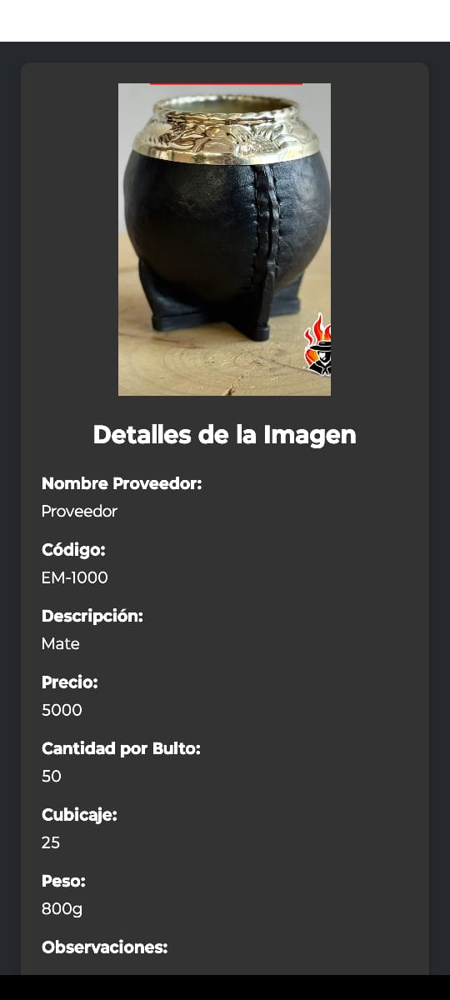
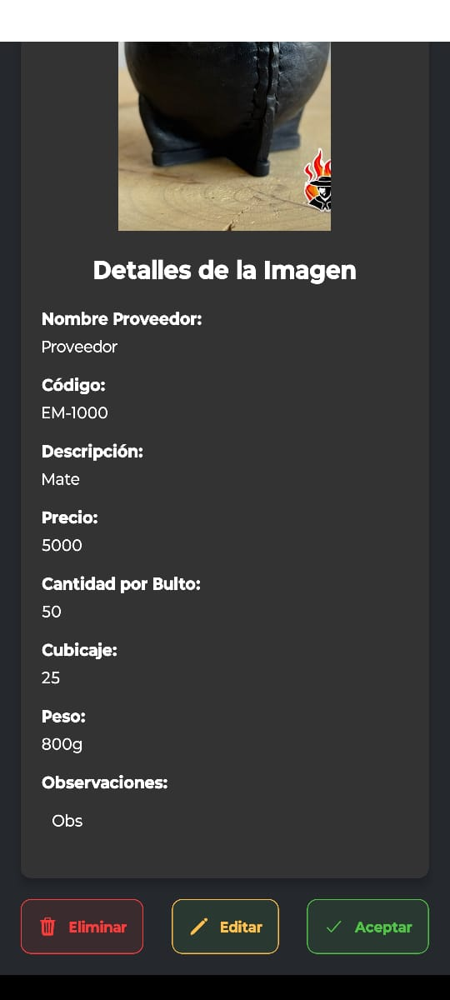

# My first mobile app 

This is an [Expo](https://expo.dev) project created with [`create-expo-app`](https://www.npmjs.com/package/create-expo-app).  
This app allows users to upload product data and automatically export it to Excel.

## How it works

<table>
  <tr>
    <td style="text-align:center;">
       
      1. Load the picture or take it
    </td>
    <td style="text-align:center;">
       
      2. Complete the form
    </td>
    <td style="text-align:center;">
       
      3. Export data
    </td>
  </tr>
</table>

---

# You can also see the data that you loaded before

  

---

And edit/delete

